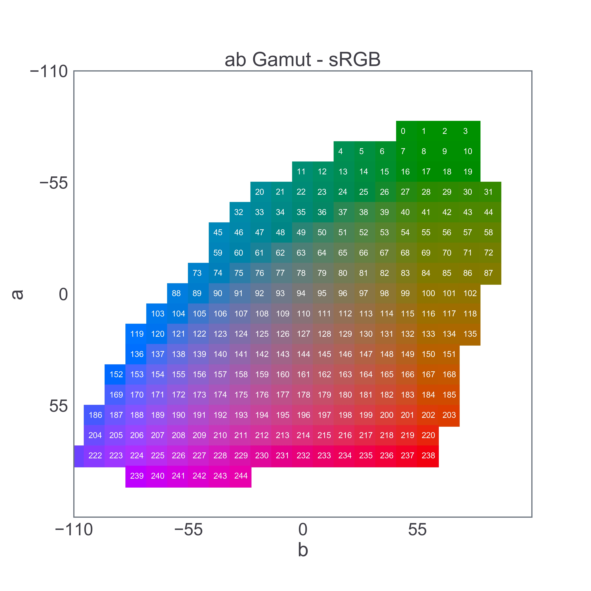
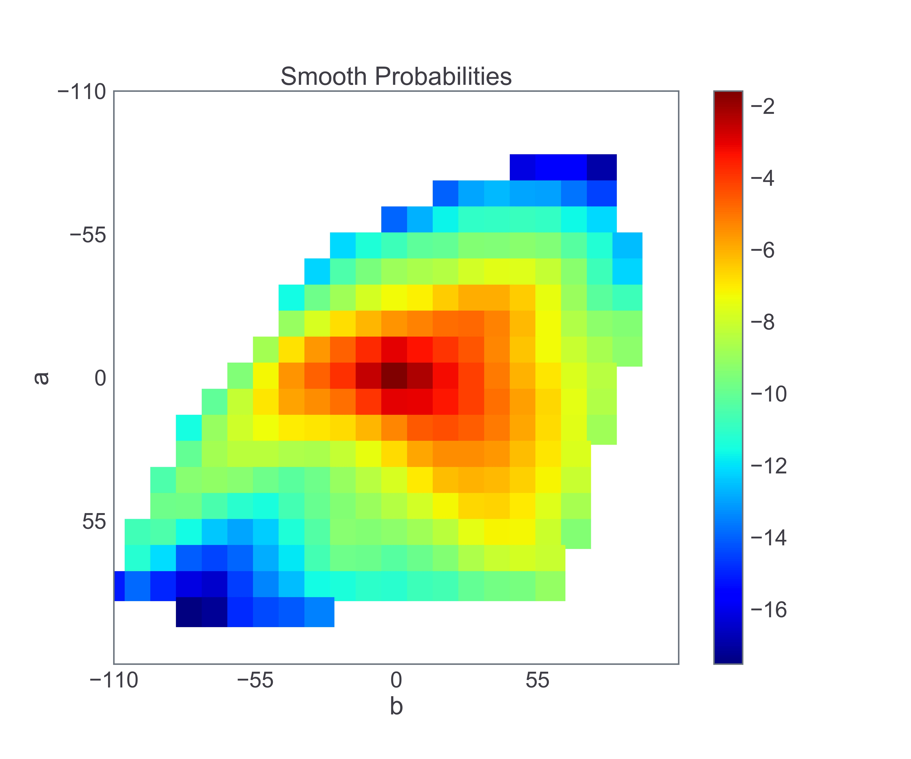

# Colorful Image Colorization

Based on the paper:
[Colorful Image Colorization](https://arxiv.org/abs/1603.08511) by [Richard Zhang](https://richzhang.github.io/), [Phillip Isola](http://people.eecs.berkeley.edu/~isola/) and [Alexei A. Efros](https://people.eecs.berkeley.edu/~efros/)

The validation set of [MS COCO 2017 dataset](http://cocodataset.org/#download) was used since my memory specs were shoddy at the time.

## Architecture

Source: Paper

## Notebooks
Notebooks are intended to be executed in the following order.

1. [GrayRemover](Notebooks/ GrayRemover.ipynb)- Remove "greyscale" images as defined in the paper.
2. [GamutBins](Notebooks/GamutBins.ipynb) - Create bins for the ab color space in gamut (in the training set).

3. [ClassRebalancer](Notebooks/ClassRebalancer.ipynb) - Find weights for each of the bins based on the probability of the color's appearance in the training set.

4. [Trainer](Notebooks/Trainer.ipynb) - Create and train the model.
5. [Colorizer](Notebooks/Colorizer.ipynb) - Use the trained model to colorize an image.

A slightly more optimized (more Keras, less Numpy) version of the Trainer is the [FastTrainer](Notebooks/FastTrainer.ipynb) notebook.
Make sure to run the [Fastener](Notebooks/Fastener.ipynb) notebook just before it, however, to preprocess the images into ab bins ahead of time.

_Note: The Model has sort of converged to an expected local minimum with the small dataset.
Notice that it tries to paint open, upper regions of the image blue and lower regions green.
The full dataset should give much better results._