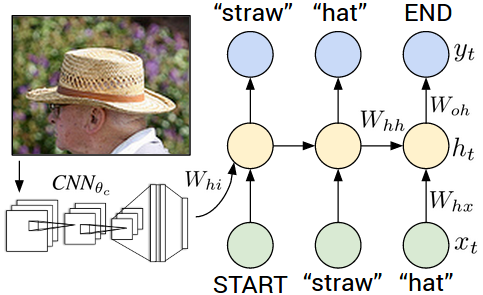

# Image Captioner

Based on the Paper:
[Deep Visual-Semantic Alignments for Generating Image Descriptions](https://arxiv.org/abs/1412.2306) by
[Andrej Karpathy](https://www.linkedin.com/in/andrej-karpathy-9a650716), [Li Fei-Fei](http://vision.stanford.edu/feifeili/)

## Architecture

Source: [Karpathy's Stanford Page](https://cs.stanford.edu/people/karpathy/)

## Notebooks
The intended sequence of notebooks is as follows:
1. [CaptionExtractor](Notebooks/Extraction/CaptionExtractor.ipynb) - Extract Captions from the MS COCO Dataset JSON file.
2. [FeatureExtractor](Notebooks/Full/FeatureExtractor.ipynb) - Extract CNN (VGG16) features from the images.
3. [Trainer](Notebooks/Full/Trainer.ipynb) - Train the model.
4. [Captioner](Notebooks/Full/Captioner.ipynb) - Generate captions.
5. [ShowCaptions](Notebooks/Full/ShowCaptions.ipynb) - Generate stored captions. Also allows to search images using said captions.

_Note: A simpler, naive Keras implementation can be found in the [ImageCaptioning-Simple](Notebooks/Simple/ImageCaptioning-Simple.ipynb) notebook._

## [Follow my Trello Board](https://trello.com/c/s2vZdvyw/26-automatic-image-caption-generation)
